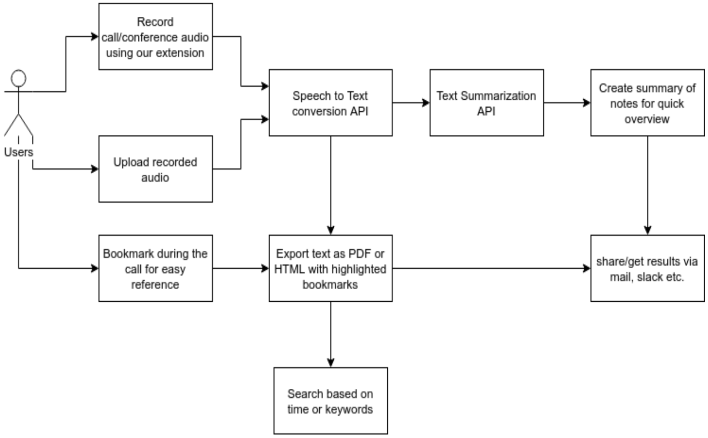

# NoteGen

An AI-powered solution for intelligent note-taking. NoteGen is a Chrome extension that generates notes from calls, allowing you to focus on conversations rather than transcription.

**Easy Collaboration → More Productivity → SAVE TIME** ✨

## Features & Workflow

- **Generate notes** by simply clicking a button while on calls
- **Multiple formats**: PDF, HTML, and text
- **To-do list**: Add action items based on call content
- **Bookmarking**: Save important sentences during calls with surrounding context (2-3 lines)
- **Summarization**: Automatically summarize generated notes
- **Search**: Find notes by keywords and timestamps
- **Translation**: Translate notes to any language
- **Sharing**: Distribute notes via email, Slack, or other platforms

